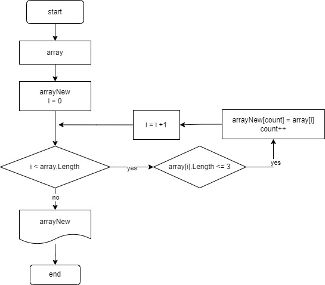

# Итоговая контрольная работа по основному блоку

## Для выполнения проверочной работы необходимо:

1. Создать репозиторий на GitHub.
2. Нарисовать блок-схему алгоритма 
_(можно обойтись блок-схемой основной содержательной части, 
если вы выделяете её в отдельный метод)._
3. Снабдить репозиторий оформленным текстовым описанием решения 
_(файл README.md)._
4. Написать программу, решающую поставленную задачу.
5. Использовать контроль версий в работе над этим небольшим проектом _(не должно быть так, что всё залито одним коммитом, как минимум этапы 2, 3, и 4 должны быть расположены в разных коммитах)._

## Задача: 

Написать программу, которая из имеющегося массива строк 
формирует новый массив из строк, длина которых меньше, 
либо равна 3 символам. 

Первоначальный массив можно ввести с клавиатуры, 
либо задать на старте выполнения алгоритма. 
При решении не рекомендуется пользоваться коллекциями, 
лучше обойтись исключительно массивами.

### Примеры:

* [“Hello”, “2”, “world”, “:-)”] → [“2”, “:-)”]
* [“1234”, “1567”, “-2”, “computer science”] → [“-2”]
* [“Russia”, “Denmark”, “Kazan”] → []

## Текстовое описание решения задачи

1. Объявление массива строк на неограниченное колличество элементов.
Объявление нового пустого массива.
2. Заполнение цикла для посчета длины в каждом элементе.
Проверка длины строк по условию <= 3.
3. Вывод нового массива.

## Блок-схема

